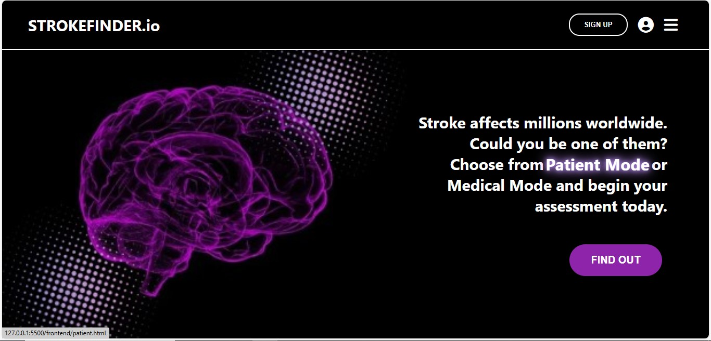
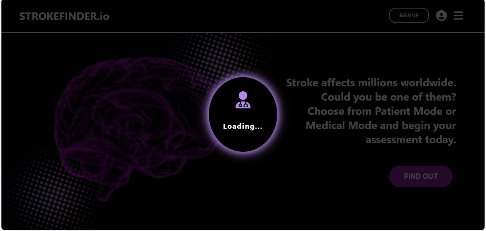
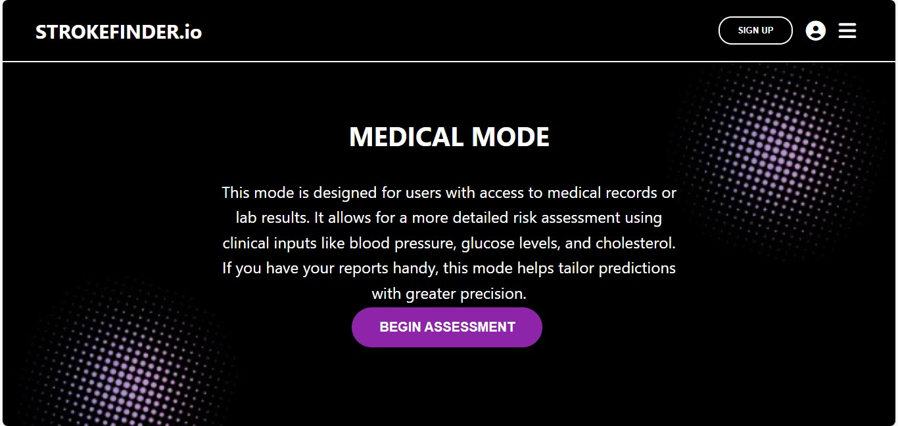
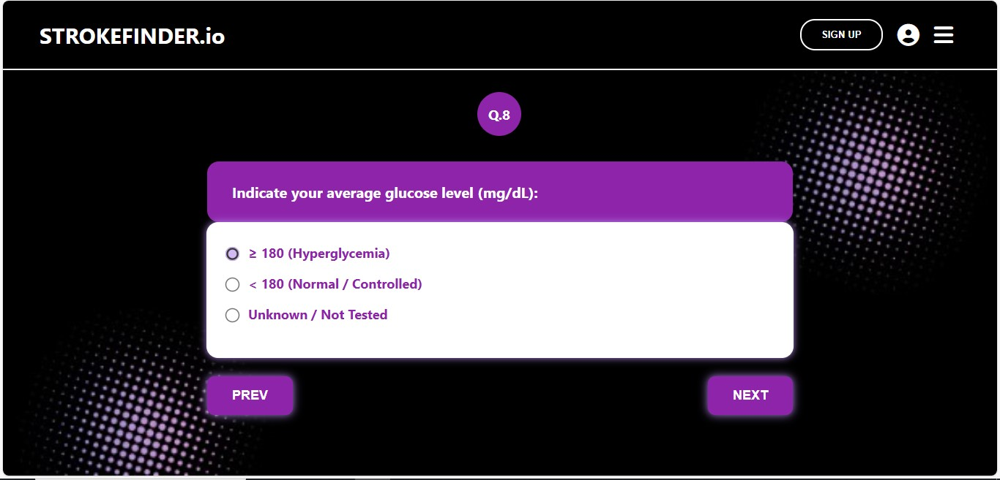
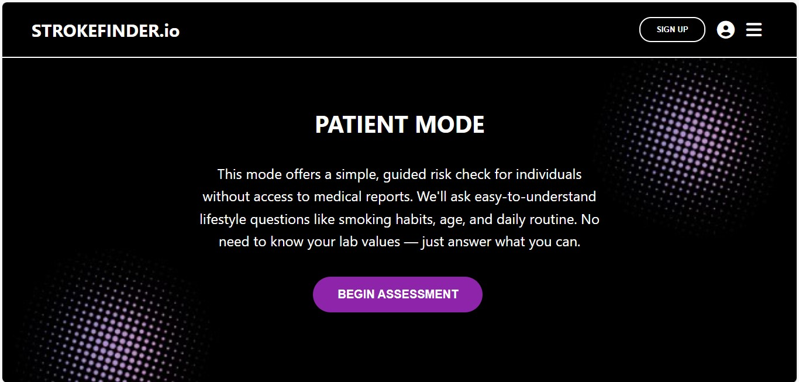
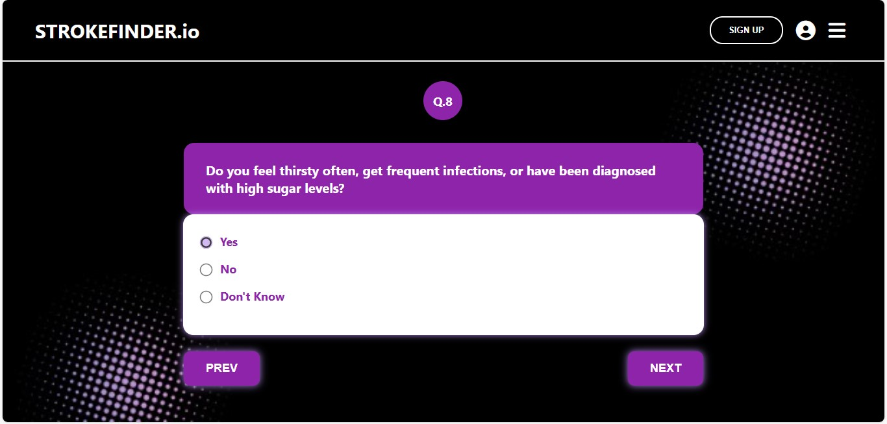
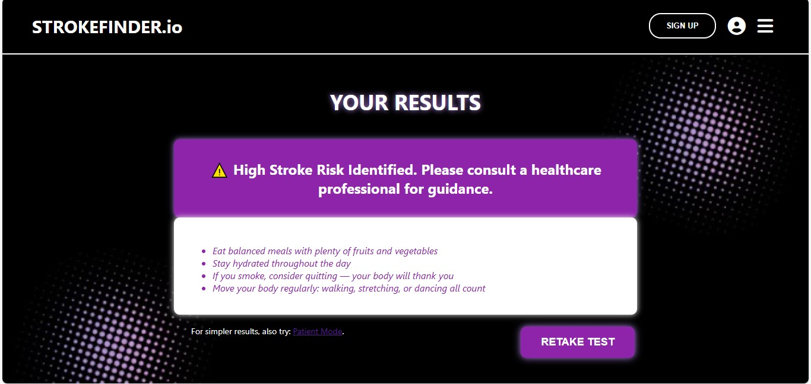
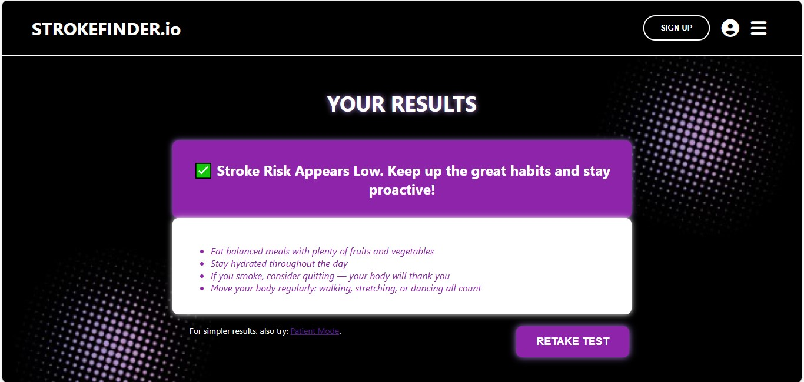

## StrokeFinder.io

**Project Duration:** 31st July 2025 - 23rd August 2025
  

## **Description**

- StrokeFinder.io is a medical web app that detects the chances of brain stroke in a patient. This app quizzes the patients and users based on 10 targeted questions.  
- The results are returned back as predictions by the model. The app provides two modes - Patient Mode & Medical Mode. 
  

## **Modes**

- **Patient Mode** - This mode offers a simple, guided risk check for individuals without access to medical reports or lab values by asking easy-to-understand lifestyle questions like smoking habits, age, and daily routine. 

- **Medical Mode** - This mode is designed for users with access to medical records or lab results. It allows for a more detailed risk assessment using clinical inputs like blood pressure, glucose levels, and cardiac issues.
  

## **Overall Structure**
**Model / Backend**

- Trained using R the language.  
- Dataset was loaded and exported from Kaggle.  
- Loads and inspects stroke dataset using tidyverse, caret, and randomForest.  
- Cleans BMI column by replacing invalid entries and imputing missing values with the mean.  
- Splits data into training (70%) and testing (30%) sets.  
- Trains a Random Forest model, evaluates with confusion matrix.  
- Handles class imbalance via downsampling and retrains the model.  
- Tunes hyperparameters using cross-validation and checks feature importance.  
- Saves the final model for future use.  
 

**API**

- The Plumber API was used to connect the backend codes to the frontend HTML page.
  

**Initial Working & Testing**

- Used Shiny App to test if the model is providing correct outputs and predictions.
  

**Frontend / Web App**

- The web app was developed purely using - HTML + CSS + JS
  

## **Some amazing features**

- Designed the images for homepages and icon on Canva.  
- Logo is clickable leading back to home page.  
- Favicon logo is self made - A brain icon and 3 dots indicating the Loading... in loading pages.  
- The text Medical Mode and Patient Mode is clickable leading to the modes.  
- The Find Out button triggers the dropdown so does the dropdown button.  
- Before each webpage loads a Doctor icon appears in the purple circle with Loading... (dots load one by one).  
- Begin Assessment button has a pebble drop animation.  
- The question number circle changes with each question.  
- Questions have a left side moving animation when Next button is clicked.  
- Try also button leads to the other modes.  
 

## **App Structure**
<pre>
StrokeFinder.io/   
├── frontend/                            - (Frontend folder)  
│ ├── index.html                         - (Intro page)  
│ ├── patient.html / medical.html        - (Intro pages for modes)  
│ ├── patient.js / medical.js            - (Javascript for modes)  
│ └── style.css                          - (Styling for app)  
├── images/                              - (Images folder)  
│ └── answer_page.jpg                    - (Quiz bg image)  
│ └── brain_homepage.jpg                 - (Homepage bg image)  
│ └── logo.jpg                           - (Logo in jpg)  
│ └── logo.ico                           - (Logo as icon)  
├── plumber.R                            - (API R code)  
├── stroke_shiny_app.R                   - (Shiny app R code)  
├── balanced_rf_model.rds                - (R model)  
├── healthcare-dataset-stroke-data.csv   - (Dataset)  
└── .Rhistory
</pre>
 

## **Author Notes**

- The idea for the frontend is solely derived from my imaginative and creative mind.  
- io in StrokeFinder.io stands for innovation.   
- Days required: The model - 2 days, Frontend - 7 days but stuck in output for 1 month but - Passion & Patience & Determination & Never Say Never attitude - helped me keep going.  
- Built with Creativity & Innovation by - Aashna .K. Shetty  
- GitHub: @aashnakshetty

## Screenshots

- Homepage

- Loading Animations

- Medical Mode Intro

- Medical Quiz

- Patient Mode Intro

- Patient Quiz

- Stroke Present

- Stroke Absent

